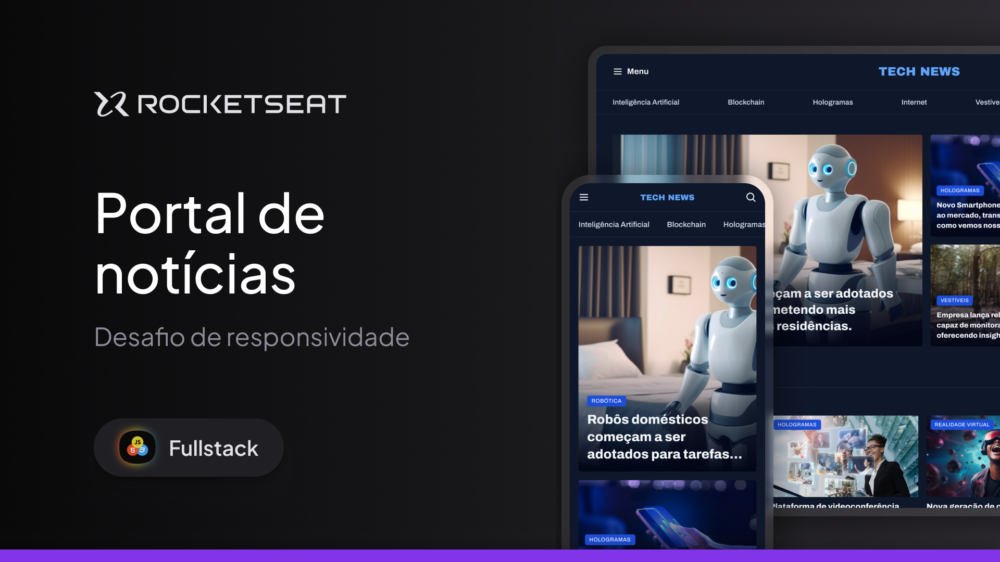

# Formação Full-Stack: Portal de notícias

Acesse em: <a href="https://limacaiquelg.github.io/fullstack-portal-de-noticias/">https://limacaiquelg.github.io/fullstack-portal-de-noticias/</a>

 

Este projeto consiste em uma página web desenvolvida utilizando HTML e CSS. Esta página exibe um portal de notícias de tecnologia dividido em diversas seções, como por exemplo: destaques, notícias da semana, inteligência artificial, etc.
 

Os seguintes tópicos são trabalhados nesta aplicação: 

<ul>
  <li>Criação de layouts com CSS</li>
  <li>Posicionamento de elementos</li>
  <li>Variáveis CSS</li>
  <li>CSS Flexbox</li>
  <li>CSS Grid</li>
  <li>Pseudo-classes e pseudo-elementos</li>
</ul>

Este projeto foi desenvolvido durante a formação Full-Stack da Rocketseat, sob a orientação do professor <a href="https://github.com/maykbrito">Mayk Brito</a>. Posteriormente, tornou-se parte do desafio de responsividade dessa mesma formação, trabalhando os seguintes tópicos: 

<ul>
    <li>Responsividade</li>
    <li>Media Queries</li>
    <li>Utilização da ferramenta DevTools do navegador</li>
    <li>Text Ellipsis utilizando CSS <i>line clamp</i></li>
</ul>

As alterações necessárias para tornar a página responsiva estão contidas nos commits <a href="https://github.com/limacaiquelg/fullstack-portal-de-noticias/commit/cb167eb07f5b7b008ab351197672f9ed450aac2f">cb167eb</a> e <a href="https://github.com/limacaiquelg/fullstack-portal-de-noticias/commit/75f006672c472af4e487e458fbc095246fd0b146">75f0066</a>.

Este projeto faz parte da formação Full-Stack da <a href="https://www.rocketseat.com.br">Rocketseat</a>.

